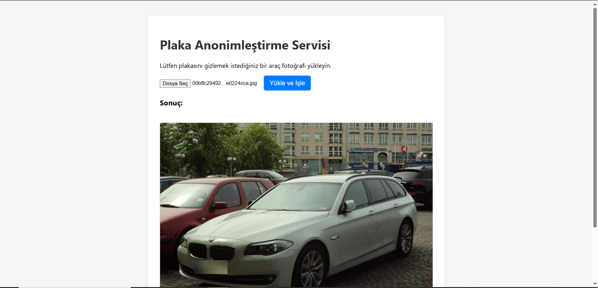

#  Plaka Anonimleştirme API'si (YOLOv8 + Flask)
_License Plate Anonymizer API (YOLOv8 + Flask)_


Bu proje, bir resimdeki araç plakalarını tespit etmek ve bu plakaları OpenCV kullanarak otomatik olarak blurlamak (anonimleştirmek) için tasarlanmış, **özel eğitilmiş bir YOLOv8 modeli** kullanan, **uçtan uca bir Bilgisayarlı Görü (Computer Vision) API** servisidir.

_This project is an end-to-end Computer Vision API service that uses a **custom-trained YOLOv8 model** to detect license plates in an image and automatically anonymize (blur) them using OpenCV._

---

##  Proje Demosu / Project Demo

Kullanıcı, plakalı bir araç resmi yükler ve API, plakaları blurlanmış resmi geri döndürür.

_The user uploads an image with a license plate, and the API returns the image with the plate blurred._

** **

---

## 🎯 Projenin Amacı / Project Purpose

Bu proje, modern bir ML/DL Geliştirici rolü için gereken tüm temel yetkinlikleri tek bir projede birleştirmektedir:

1.  **Veri Toplama ve İşleme:** Veri setinin (Roboflow) hazırlanması.
2.  **Model Eğitimi:** Özel bir YOLOv8 modelinin sıfırdan eğitilmesi ve değerlendirilmesi.
3.  **API Geliştirme:** Eğitilen modelin bir Flask web sunucusu üzerinden "Web API" olarak sunulması.
4.  **Entegrasyon:** Görüntü işleme (OpenCV) ile model çıktılarının birleştirilmesi.
5.  **Arayüz:** Modelin son kullanıcı tarafından test edilebilmesi için basit bir HTML/JavaScript arayüzü sağlanması.

---

## Nasıl Çalışır? / How It Works (Süreç Akışı)

Proje, basit bir istemci-sunucu (client-server) mimarisiyle çalışır:

1.  **İstemci (Kullanıcı):** Kullanıcı `http://127.0.0.1:5000` adresine girer.
2.  **Sunucu (Flask):** `app.py`, `/` rotası (route) için `templates/index.html` dosyasını kullanıcıya sunar.
3.  **İstemci (Arayüz):** Kullanıcı bir resim seçer ve "Yükle" butonuna tıklar.
4.  **JavaScript (`fetch`)**: `index.html` içindeki script, bu resmi bir `POST` isteğiyle `/api/anonymize` endpoint'ine (API'ye) gönderir.
5.  **Sunucu (API - `app.py`):**
    a. `/api/anonymize` rotası bu isteği alır.
    b. Sunucu başlarken **hafızaya (VRAM/RAM) yalnızca bir kez yüklenmiş** olan `model = YOLO("best.pt")` (Uzman Aşçı) çağrılır.
    c. Model, gelen resim üzerinde kestirim (inference) yapar ve plaka koordinatlarını bulur.
    d. `OpenCV (cv2.GaussianBlur)`, bu koordinatları alarak resim üzerinde ilgili bölgeleri blurlar.
    e. Blurlanmış resim, `send_file` komutuyla istemciye (JavaScript'e) geri gönderilir.
6.  **İstemci (Sonuç):** JavaScript, gelen blurlanmış resmi alır ve `` etiketi içinde ekranda gösterir.

---

## Kullanılan Teknolojiler / Technology Stack

* **Model:** `YOLOv8 (Ultralytics)`
* **API Sunucusu:** `Flask`
* **Görüntü İşleme:** `OpenCV-Python`
* **Çekirdek Dil:** `Python 3.9`
* **Ortam Yönetimi:** `Anaconda`
* **Arayüz:** `HTML` & `JavaScript (ES6+ Fetch API)`

---

## Proje Bileşenleri / Core Components

Proje, "Model Atölyesi" ve "API Sunucusu" olarak iki ana bölümden oluşur:

1.  ### `YOLO_Egitim/` (Model Atölyesi)
    Burası, API'nin "beyni" olan `best.pt` modelinin eğitildiği yerdir.
    * `data.yaml`: Veri setinin (train, valid, test) ve sınıfların (plaka) tanımlandığı yapılandırma dosyası.
    * `train.py`: `YOLOv8n` modelini özel veri setimizle eğitmek için kullanılan script. `resume=True` gibi özellikler içerir.
    * `test.py`: Eğitilen modelin, daha önce hiç görmediği "test" veri seti üzerindeki performansını (mAP) ölçmek için kullanılan script.
    * `runs/detect/`: Eğitimin tüm sonuçlarının (ağırlıklar, `results.png` grafikleri, `confusion_matrix.png` vb.) saklandığı klasör.

2.  ### `/` (API Sunucusu)
    Burası, modelin dünyaya sunulduğu yerdir.
    * **`app.py` (Motor):** Flask sunucusunun ana kodudur. Modeli hafızaya yükler (`YOLO("best.pt")`), `/` rotasını (arayüz) ve `/api/anonymize` rotasını (blurlama mantığı) yönetir.
    * **`best.pt` (Beyin):** `YOLO_Egitim/` klasöründe eğitilmiş ve buraya kopyalanmış, kullanıma hazır model dosyası.
    * **`templates/index.html` (Vitrin):** Kullanıcının gördüğü ve resim yüklediği arayüz.
    * **`requirements.txt` (Malzeme Listesi):** Projenin çalışması için gereken tüm Python kütüphanelerinin listesi (`pip install -r requirements.txt`).

---

##  Model Eğitimi ve Değerlendirme / Model Training & Evaluation

API'nin kalitesi, modelin kalitesine bağlıdır.

* **Eğitim:** Model, `YOLO_Egitim/train.py` script'i çalıştırılarak (RTX 3050 Ti 4GB GPU üzerinde `batch=4` ayarıyla) eğitilmiştir.
* **Sonuçlar:** `results.png` grafiği, modelin `mAP50` (doğruluk) skorunun 50 epoch boyunca istikrarlı bir şekilde arttığını ve ezberleme (overfitting) yapmadığını göstermiştir.
* **Hata Tespiti (ÖNEMLİ):** `confusion_matrix.png` (Karışıklık Matrisi) analizi, veri setindeki bir kirliliği ortaya çıkarmıştır: "Plaka" olması gereken sınıf, Roboflow'dan 4 farklı isimde (`v2 2023...`, `March 5...` vb.) gelmiştir.
* **Çözüm:** Veri seti, Roboflow üzerinde temizlenmiş, tüm sınıflar tek bir **"plaka"** sınıfı altında birleştirilmiş ve model bu **temiz veri** ile yeniden eğitilerek API'ye hazır hale getirilmiştir. Bu süreç, modelin "arka planı" (plaka olmayan yerleri) plaka sanma (False Positive) oranını ciddi ölçüde düşürmüştür.

---

##  Kurulum ve Çalıştırma / Installation & Usage

Bu projeyi kendi yerel makinenizde çalıştırmak için:

1.  **Repository'yi klonlayın:**
    ```bash
    git clone [https://github.com/KULLANICI_ADINIZ/YOLOv8-Flask-Plate-Anonymizer.git](https://github.com/KULLANICI_ADINIZ/YOLOv8-Flask-Plate-Anonymizer.git)
    cd YOLOv8-Flask-Plate-Anonymizer
    ```

2.  **Conda sanal ortamını oluşturun ve aktive edin:**
    ```bash
    # (Eğer ortamınız kurulu değilse)
    # conda create -n flask_yolo python=3.9 -y
    
    conda activate flask_yolo
    ```

3.  **Gerekli kütüphaneleri yükleyin:**
    ```bash
    pip install -r requirements.txt
    ```

4.  **Flask sunucusunu başlatın:**
    ```bash
    python app.py
    ```

5.  **Test edin:**
    * Tarayıcınızı açın ve `http://127.0.0.1:5000` adresine gidin.
